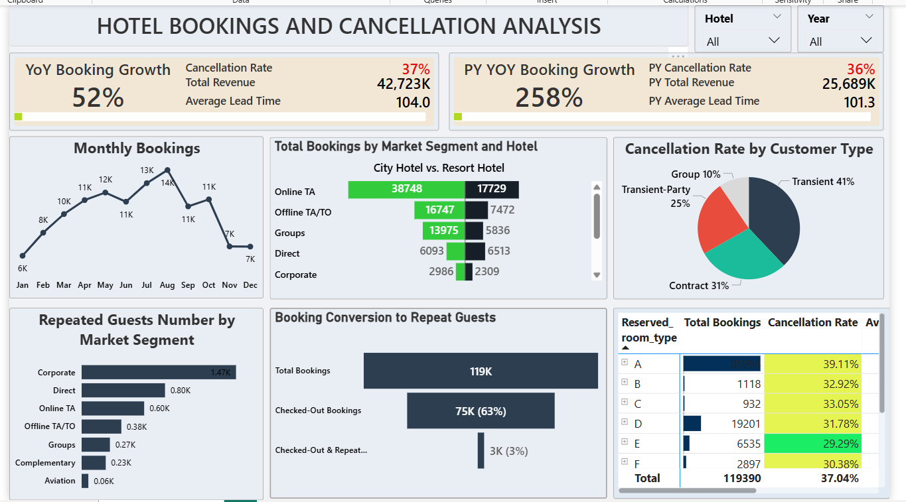

---

This project features a dynamic and user-friendly Power BI dashboard designed to analyze and visualize data. It is built for easy exploration, allowing users to interact directly with the data through a variety of slicers and filters. The visuals are fully interconnected, meaning that any selection will dynamically update the entire report, making it simple to drill down into specifics and transform complex data into clear, actionable insights.

Hotel Bookings & Cancellation Analysis Dashboard

This project analyzes booking patterns, cancellation behavior, and revenue performance for City and Resort hotels using a real-world hotel booking dataset. The workflow includes end-to-end data preparation (ETL), data modeling, and interactive dashboard development in Power BI.

The dataset was cleaned and transformed to handle missing values, engineer date fields, and create DAX-based KPIs such as Total Bookings, Cancellation Rate, YOY Growth, and Total Revenue. The final dashboard features advanced visualizations—including a Tornado Chart, Funnel Chart, KPI cards, and trend analysis—to help stakeholders identify high-cancellation segments, seasonal demand patterns, and guest retention gaps.

This project demonstrates practical skills in data analytics, business intelligence, DAX, visualization design, and insight storytelling, making it a complete data-driven solution for hotel performance monitoring and decision-making.

